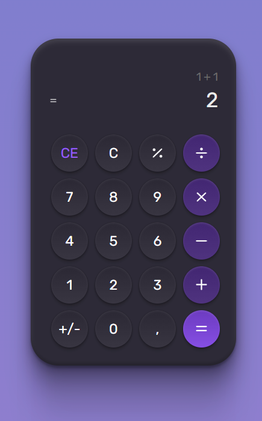

# Calculadora
## Desafio #Boracodar feito em Reactjs

## :dart:  Desafio

A ideia agora é desenvolver uma calculadora conforme layout produzido no figma.

## Resumo do que foi feito e o que aprendi
- Foi criada a interface da calculadora usando os componentes em react.js 
- Componentização de elementos
- Vite
- React DOM
- Fragment
- CSS dentro de Javascript
- Temas Globais e Temas Individuais

## Principais pontos abordados

- Analisar projeto no Figma 

- REACT.JS

## :mailbox_closed: Contatos

> Email - rosendc30@gmail.com

> Linkedin - https://www.linkedin.com/in/francisco-rosendo-coelho/# gitfavorites